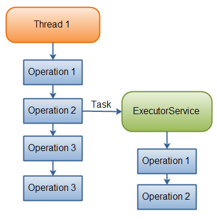

## Info and Docs
[Java ExecutorService](http://tutorials.jenkov.com/java-util-concurrent/executorservice.html)

## Java ExecutorService
The Java ExecutorService interface, java.util.concurrent.ExecutorService, represents an asynchronous execution mechanism which is capable of executing tasks concurrently in the background.

## Task Delegation
Here is a diagram illustrating a thread delegating a task to a Java ExecutorService for asynchronous execution:



Once the thread has delegated the task to the ExecutorService, the thread continues its own execution independent of the execution of that task. The ExecutorService then executes the task concurrently, independently of the thread that submitted the task.

## Java ExecutorService Example
Before we get too deep into the ExecutorService, let us look at a simple example. Here is a simple Java ExecutorService example:

[SimpleExample](./src/main/java/com/kscm/execservice/ex1/SimpleExample.java)

## Java ExecutorService Implementations
The Java ExecutorService is very similar to a thread pool. In fact, the implementation of the ExecutorService interface present in the java.util.concurrent package is a thread pool implementation. 

If you want to understand how the ExecutorService interface can be implemented internally, read the above tutorial. [thread pool](http://tutorials.jenkov.com/java-concurrency/thread-pools.html)

Since ExecutorService is an interface, you need to its implementations in order to make any use of it. The ExecutorService has the following implementation in the **java.util.concurrent** package:

- ThreadPoolExecutor
- ScheduledThreadPoolExecutor

## Creating an ExecutorService
How you create an ExecutorService depends on the implementation you use. However, you can use the Executors factory class to create ExecutorService instances too. Here are a few examples of creating an ExecutorService:
```text
ExecutorService executorService1 = Executors.newSingleThreadExecutor();

ExecutorService executorService2 = Executors.newFixedThreadPool(10);

ExecutorService executorService3 = Executors.newScheduledThreadPool(10);
```

## ExecutorService Usage
There are a few different ways to delegate tasks for execution to an ExecutorService:

- execute(Runnable)
- submit(Runnable)
- submit(Callable)
- invokeAny(...)
- invokeAll(...)

## Execute Runnable
The Java ExecutorService execute(Runnable) method takes a java.lang.Runnable object, and executes it asynchronously. Here is an example of executing a Runnable with an ExecutorService:

[ExecuteRunnableExample.java](./src/main/java/com/kscm/execservice/ex2/ExecuteRunnableExample.java)

## Submit Runnable
The Java ExecutorService submit(Runnable) method also takes a Runnable implementation, but returns a Future object. This Future object can be used to check if the Runnable has finished executing.

Here is a Java ExecutorService submit() example:

[SubmitRunnable.java](./src/main/java/com/kscm/execservice/ex3/SubmitRunnable.java)

## Submit Callable
The Java ExecutorService submit(Callable) method is similar to the submit(Runnable) method except it takes a Java Callable instead of a Runnable. The precise difference between a Callable and a Runnable is explained a bit later.

The Callable's result can be obtained via the Java Future object returned by the submit(Callable) method. Here is an ExecutorService Callable example:

[SubmitCallable.java](./src/main/java/com/kscm/execservice/ex4/SubmitCallable.java)

## invokeAny()
The invokeAny() method takes a collection of Callable objects, or subinterfaces of Callable. Invoking this method does not return a Future, but returns the result of one of the Callable objects. You have no guarantee about which of the Callable's results you get. Just one of the ones that finish.

If one Callable finishes, so that a result is returned from invokeAny(), then the rest of the Callable instances are cancelled.

If one of the tasks complete (or throws an exception), the rest of the Callable's are cancelled.

Here is a code example:

[InvokeAnyExample.java](./src/main/java/com/kscm/execservice/ex5/InvokeAnyExample.java)

## invokeAll()
The invokeAll() method invokes all of the Callable objects you pass to it in the collection passed as parameter. The invokeAll() returns a list of Future objects via which you can obtain the results of the executions of each Callable.

Keep in mind that a task might finish due to an exception, so it may not have "succeeded". There is no way on a Future to tell the difference.

Here is a code example:

[InvokeAllExample.java](./src/main/java/com/kscm/execservice/ex6/InvokeAllExample.java)

## Cancel Task
You can cancel a task (Runnable or Callable) submitted to a Java ExecutorService by calling the cancel() method on the Future returned when the task is submitted. Cancelling the task is only possible if the task has not yet started executing. Here is an example of cancelling a task by calling the Future.cancel() method:

```java
future.cancel();
```

## ExecutorService Shutdown
When you are done using the Java ExecutorService you should shut it down, so the threads do not keep running. If your application is started via a main() method and your main thread exits your application, the application will keep running if you have an active ExexutorService in your application. The active threads inside this ExecutorService prevents the JVM from shutting down.

####shutdown()
To terminate the threads inside the ExecutorService you call its shutdown() method. The ExecutorService will not shut down immediately, but it will no longer accept new tasks, and once all threads have finished current tasks, the ExecutorService shuts down. All tasks submitted to the ExecutorService before shutdown() is called, are executed. Here is an example of performing a Java ExecutorService shutdown:

```java
executorService.shutdown();
```

####shutdownNow()
If you want to shut down the ExecutorService immediately, you can call the shutdownNow() method. This will attempt to stop all executing tasks right away, and skips all submitted but non-processed tasks. There are no guarantees given about the executing tasks. Perhaps they stop, perhaps the execute until the end. It is a best effort attempt. Here is an example of calling ExecutorService shutdownNow:

```java
executorService.shutdownNow();
```

####awaitTermination()
The ExecutorService awaitTermination() method will block the thread calling it until either the ExecutorService has shutdown completely, or until a given time out occurs. The awaitTermination() method is typically called after calling shutdown() or shutdownNow(). Here is an example of calling ExecutorService awaitTermination():

```java
executorService.shutdown();

executorService.awaitTermination(10_000L, TimeUnit.MILLISECONDS );
```

## Java Callable
The Java Callable interface, java.util.concurrent.Callable, represents an asynchronous task which can be executed by a separate thread. For instance, it is possible to submit a Callable object to a Java ExecutorService which will then execute it asynchronously.

####Java Callable Interface Definition
The Java Callable interface is quite simple. It contains a single method named call(). Here is how the Callable interface looks (approximately):

```java
public interface Callable<V> {

    V call() throws Exception;

}
```
The call() method is called in order to execute the asynchronous task. The call() method can return a result. If the task is executed asynchronously, the result is typically propagated back to the creator of the task via a Java Future. This is the case when a Callable is submitted to an ExecutorService for concurrent execution.

The call() method can also thrown an Exception in case the task fails during execution.

#### Implementing Callable
Here is a simple example of implementing the Java Callable interface:
```java
public class MyCallable implements Callable<String> {

    @Override
    public String call() throws Exception {
        return String.valueOf(System.currentTimeMillis());
    }
}
```
This implementation is very simple. It has the generic type set to a Java String. The result of that is that the call() method will return a String. The call() implementation just returns a String representation of the current time in milliseconds. In a real application the task would probably be a more complex, or larger, set of operations.

Quite often, IO operations like reading from or writing to disk or network, are good candidates for tasks that can be executed concurrently. IO operations often have long waiting times in between reading and writing blocks of data. By executing such tasks in a separate thread, you avoid blocking your main application thread unnecessarily.
## Runnable vs. Callable
The Runnable interface is very similar to the Callable interface. The Runnable interface represents a task that can be executed concurrently by a thread or an ExecutorService. The Callable can only be executed by an ExecutorService. Both interfaces only has a single method. There is one small difference between the Callable and Runnable interface though. The difference between the Runnable and Callable interface is more easily visible when you see the interface declarations.

Here is first the Runnable interface declaration:

````java
public interface Runnable {
    public void run();
}
````
And here is the Callable interface declaration:

```java
public interface Callable{
    public Object call() throws Exception;
}
```
The main difference between the Runnable run() method and the Callable call() method is that the call() method can return an Object from the method call. Another difference between call() and run() is that call() can throw an exception, whereas run() cannot (except for unchecked exceptions - subclasses of RuntimeException).

If you need to submit a task to a Java ExecutorService and you need a result from the task, then you need to make your task implement the Callable interface. Otherwise your task can just implement the Runnable interface.

Additionally, a Runnable was originally designed for long running concurrent execution, e.g. running a network server concurrently, or watching a directory for new files. The Callable interface is more designed for one-off tasks that return a single result.


