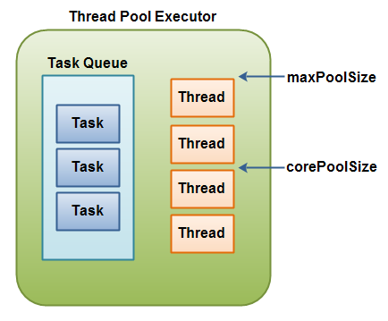

##Info
[How “Threadpool” works internally in Java](https://medium.com/coding-becomes-easy/how-threadpool-works-internally-in-java-904f1e87fea)

## ThreadPoolExecutor
The java.util.concurrent.ThreadPoolExecutor is an implementation of the ExecutorService interface.

The ThreadPoolExecutor **executes** the given task (**Callable or Runnable**) using one of its internally pooled threads.

The thread pool contained inside the ThreadPoolExecutor can contain a varying amount of threads. The number of threads in the pool is determined by these variables:

- corePoolSize
- maximumPoolSize

If less than corePoolSize threads are created in the the thread pool when a task is delegated to the thread pool, then a new thread is created, even if idle threads exist in the pool.

If the internal queue of tasks is full, and corePoolSize threads or more are running, but less than maximumPoolSize threads are running, then a new thread is created to execute the task.

Here is a diagram illustrating the ThreadPoolExecutor principles:



## Creating a ThreadPoolExecutor
The ThreadPoolExecutor has several constructors available. For instance:

```text
int  corePoolSize  =    5;
int  maxPoolSize   =   10;
long keepAliveTime = 5000;

ExecutorService threadPoolExecutor =
        new ThreadPoolExecutor(
                corePoolSize,
                maxPoolSize,
                keepAliveTime,
                TimeUnit.MILLISECONDS,
                new LinkedBlockingQueue<Runnable>()
                );
```
However, unless you need to specify all these parameters explicitly for your ThreadPoolExecutor, it is often easier to use one of the factory methods in the java.util.concurrent.Executors class, as shown in the ExecutorService text.

[ThreadPoolExecutorExample.java](./src/main/java/com/kscm/threadpoolexecutor/ThreadPoolExecutorExample.java)
[ThreadPoolExecutorExample2.java](./src/main/java/com/kscm/threadpoolexecutor/ThreadPoolExecutorExample2.java)